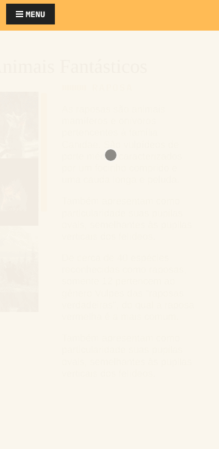

# Animais Fantásticos
Projeto desenvolvido durante o curso de Javascript Completo ES6 da Origamid. Tem como objetivo colocar em prática os conhecimentos de Javascript.

## Recursos utilizados
* Manipulação do DOM
* Async, await e Fetch
* Classes e Herança
* ESLINT
* Babel
* Webpack
* NPM

### Recursos desenvolvidos
* Menus dropdown
* Menu hamburguer no mobile
* Modal
* Navegação por Tabs
* Exibir animação ao scrollbar
* Animar números até chegar ao atual
* Accordion
* Slider
* Fetch em API do bitcoin
* Tooltip no mapa

## Desktop 

 
## Mobile

